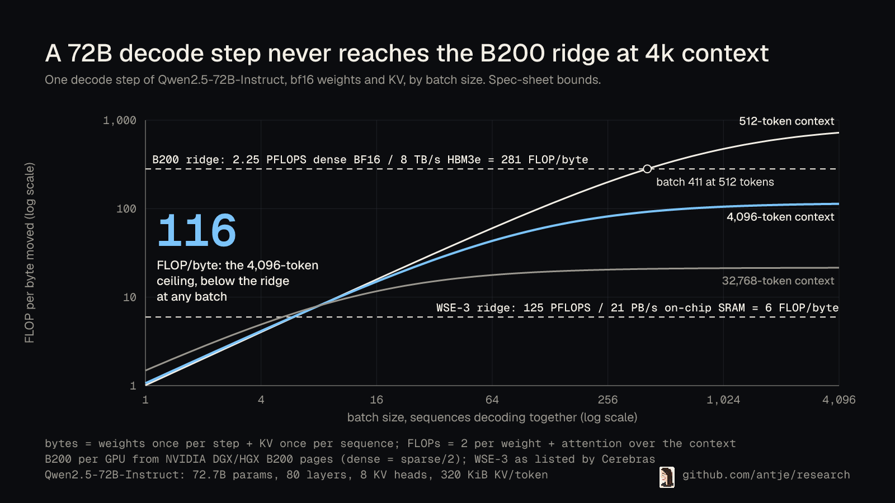
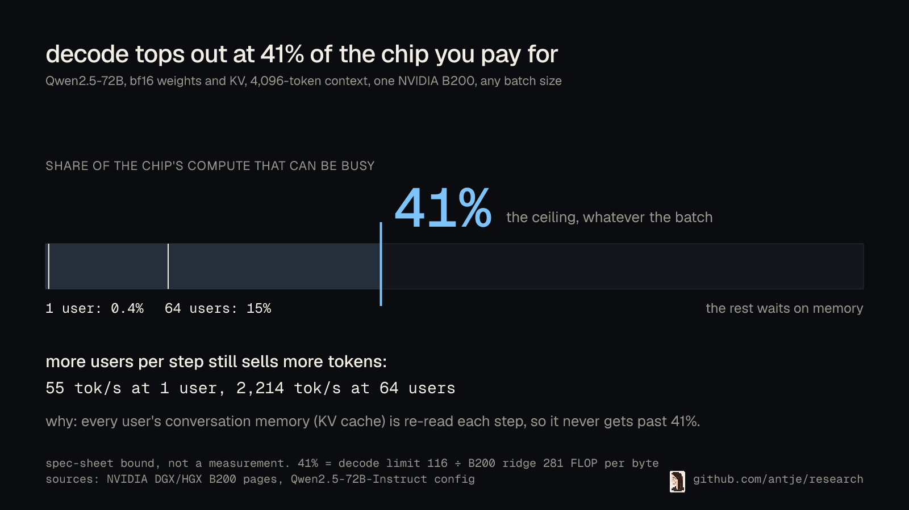
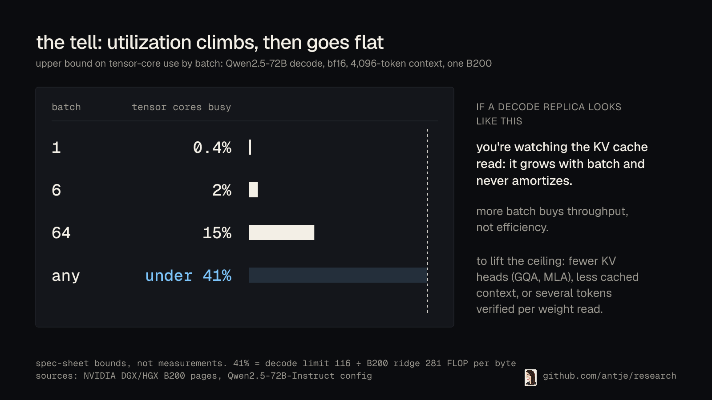
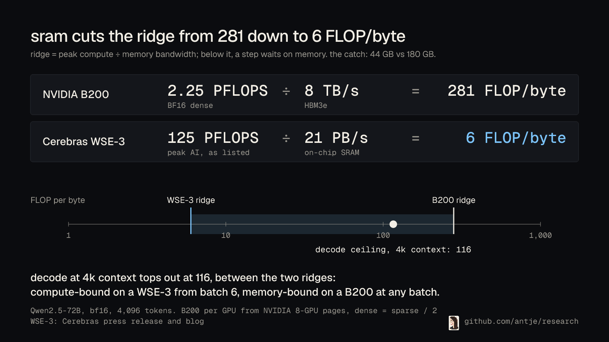
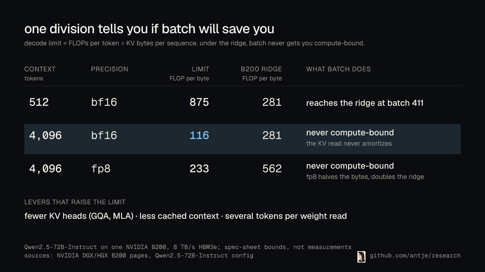
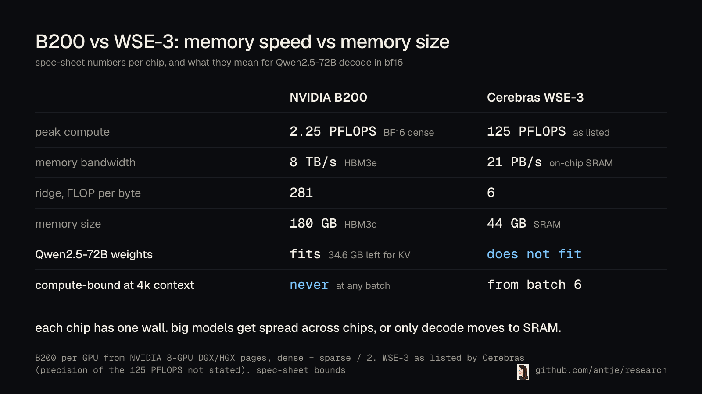

# Decode wants SRAM



Gimlet Labs announced today that it is adding Cerebras wafer-scale chips to its inference cloud: a plan for 100 megawatts of capacity, and speeds of up to 3,000 tokens per second. The number I want to explain is a different one: why a chip with 44 GB of memory earns a place next to GPUs that carry 180 GB. The answer is a roofline, and it takes a few lines of Python to compute.

## One decode step, in bytes and FLOPs

To generate one token, a dense transformer reads every weight once and reads the KV cache of every sequence in the batch. Qwen2.5-72B-Instruct has 72.7B parameters, so in bf16 that is 145.4 GB of weights per step. Its KV cache costs 320 KiB per token (80 layers, 8 KV heads, head dim 128, K and V in bf16), so a sequence with 4,096 cached tokens adds 1.3 GB.

The FLOPs are small by comparison: two per weight, plus attention over the context. At batch 1 that is 0.16 TFLOP against 146.8 GB moved, or 1.1 FLOP per byte.

A B200 does 2.25 PFLOPS of dense BF16 and moves 8 TB/s from HBM3e, which puts its ridge point at 281 FLOP per byte. Below the ridge, memory is the limiter: at batch 1 the step spends 18 ms streaming weights, uses 0.4% of the tensor cores, and is bounded at 55 tokens per second for that one user. No kernel beats it, because the bytes have to move.


*The chef is fast and the pantry is far away. At batch 1 the tensor cores mostly wait on memory.*

## Batch helps, then stops helping

Batching amortizes the weight read across sequences, and the intensity climbs: 43 FLOP per byte at batch 64 (2,214 tokens per second for the whole batch, 15% of peak compute) and 105 at batch 1,024. Capacity is a separate constraint: bf16 weights leave 34.6 GB free on a B200, about 25 sequences of 4,096 tokens, so the larger batches need tensor parallelism or FP8; splitting the model divides FLOPs and bytes alike and leaves the intensity where it is. The KV read grows with the batch, though, 1.3 GB per sequence, and it never amortizes. So the intensity converges to a limit: FLOPs per token divided by KV bytes per sequence. At 4,096 tokens of context that limit is 116 FLOP per byte.

The limit sits below the ridge. At this context length, no batch size makes a 72B decode step compute-bound on a B200. The tell: if tensor-core utilization on a decode replica climbs with batch and then flattens below 41% (the limit divided by the ridge), you are looking at the KV read, and more batch buys throughput but not efficiency.

Shorter contexts change the picture. At 512 tokens the limit is 875 FLOP per byte, and batch 411 reaches the ridge. FP8 weights and KV halve the bytes, but they also double the FP8 ridge to 562, so the batch at the ridge stays at 411 and the 4k limit (233) is still under it. Precision moves both sides of the ratio.

## What on-chip SRAM changes

The ridge is a ratio, and SRAM-centric chips attack the denominator. Cerebras lists the WSE-3 at 125 petaflops with 21 petabytes per second of memory bandwidth, aggregated across the wafer's cores, which puts its ridge at 6 FLOP per byte. Batch 6 saturates it at all three context lengths in the table (512, 4,096, and 32,768 tokens). By batch 6, where a B200 is still using about 2% of its tensor cores, this chip is already compute-bound. Cerebras does not state the precision behind the 125 petaflops; if it is a with-sparsity figure, the dense ridge is nearer 3 FLOP per byte and batch 3 saturates it, which strengthens the point.

The price is capacity. The WSE-3 has 44 GB of SRAM. A B200 has 126 MB of SRAM and 180 GB of HBM (Gimlet's post on SRAM-centric chips has the comparison, with Groq's 230 MB in between). Qwen2.5-72B does not fit on one wafer in bf16 or fp8. Qwen2.5-7B fits, with room for about 500,000 KV tokens. Larger models have to be spread across chips, as Gimlet's post says, or inference has to be split so that only the bandwidth-bound phase lands on SRAM. That is what prefill/decode, attention/FFN, and speculative-decode disaggregation are for. Gimlet's post says the architecture is suited to the token-generation phase, where latency matters most; the roofline above is the reason.

## Measured on a B200

The roofline above comes from spec sheets, so `code/` also ships a GPU script that checks it on one NVIDIA B200 (driver 580.173.02, CUDA 13.0, torch 2.13.0+cu130, clocks not locked). It builds one Qwen2.5-72B decoder layer with random bf16 weights, times a decode step with CUDA graphs across batch sizes, and scales the result to 80 layers.

At batch 1 and 4,096 tokens, a layer takes 338 us against a spec bound of 222 us, or 37 tok/s for 80 layers against the full-model bound of 55. Plain PyTorch kernels get 66% of the way to the bound.

The tell shows up on the real chip. At 4,096 tokens, compute used goes 0.2%, 0.9%, 3.5%, 10.3%, 20.1%, and 21.9% for batch 1, 4, 16, 64, 256, and 1,024, then stops climbing, well under the 41% ceiling. At 512 tokens the same batches reach 43.3%. The flat part is the KV read: attention per sequence floors at 2.28 us per layer, the time to stream that sequence's 16.8 MB of KV, while the rest of the layer per sequence drops from 326.82 us to 1.56 us. The measured curve sits below the bound because attention and the matmuls run one after the other. At batch 1,024, attention alone takes 2,330 us per layer, about the whole layer's bound of 2,367 us.

What about the B200's own on-chip memory? A batch-1 GEMV reads 13.25 TB/s from L2 and 7.25 TB/s from HBM, 1.8x faster, but the L2 holds 126.5 MiB and one layer's weights are 1.76 GB. Decode streams from HBM.

## Run it

```bash
cd code && uv run pytest -q && uv run python -m decode_roofline
# on a CUDA GPU, with torch installed:
cd code && python3 -m decode_roofline.gpu_decode
```

The package computes bytes, FLOPs, intensity, the intensity limit, the batch that reaches each chip's ridge, and what fits, for any config.json you give it. Every chip number is a spec-sheet value with its derivation in [`chips.py`](code/decode_roofline/chips.py). The GPU script prints [`results/b200-decode.md`](code/results/b200-decode.md) in seconds on a B200. Assumptions of the bound: one GPU, a dense model (MoE lowers FLOPs per token faster than bytes, so the limit drops further), one token per sequence per step (speculative decoding verifies several tokens per weight read and raises intensity by that factor), a full-context KV read (no prefix sharing or sparse attention), and peak rather than achievable bandwidth.

## The rule

Before you buy batch for decode, compute the intensity limit: FLOPs per token divided by KV bytes per sequence. If it is below your chip's ridge, batch will raise throughput but the step stays memory-bound. Then shrink the KV bytes (FP8 KV alone lifts the 4k limit only to 233, so GQA or MLA have to do the rest), keep less context in the cache, verify more than one token per step, or move decode to memory with a lower ridge.

<!-- audiences:start -->
## What this means for you

### For people who use chatbots and never think about chips


making one token for one user, the chip writing your chatbot reply keeps 0.4% of its math busy. the rest waits on memory.

### For investors, business folks, anyone paying for GPUs



more users per gpu still sells more tokens. it just never makes the chip more than 41% busy at 4k context.

### For performance and capacity engineers



if decode utilization climbs with batch and then goes flat, you're looking at the kv cache read.

### For CUDA, hardware, and co-design folks



the ridge is peak compute over bandwidth. sram drops it from 281 to 6, and 4k decode (116) sits in between.

### For ML and inference engineers who tune batch size



flops per token over kv bytes per sequence. if that's under your chip's ridge, batch won't make decode compute-bound.

### For hardware and market analysts



B200 vs WSE-3 on paper: one wall each. the gpu runs out of bandwidth, the wafer runs out of room.
<!-- audiences:end -->

## Sources

- Gimlet Labs, "Scaling low-latency inference with Gimlet Cloud and Cerebras", Sep 28 2026: https://gimletlabs.ai/blog/cerebras-announcement
- Gimlet Labs, "The emerging role of SRAM-centric chips in AI inference", Mar 5 2026: https://gimletlabs.ai/blog/sram-centric-chips
- NVIDIA DGX B200 specifications (8 GPUs: 1,440 GB, 64 TB/s HBM3e; the page's footnote says its tensor-core specs are shown in sparse and dense is half): https://www.nvidia.com/en-us/data-center/dgx-b200/
- NVIDIA HGX B200 specifications (8 GPUs: FP16/BF16 36 PFLOPS, FP8 72 PFLOPS; read on the same sparse basis as the DGX page, so dense per GPU = 36 / 2 / 8): https://www.nvidia.com/en-us/data-center/hgx/
- Cerebras, WSE-3 press release (44 GB on-chip SRAM, 125 petaflops peak AI performance): https://www.cerebras.ai/press-release/cerebras-announces-third-generation-wafer-scale-engine
- Cerebras, "Introducing Cerebras Inference" (21 petabytes/s aggregate memory bandwidth): https://www.cerebras.ai/blog/introducing-cerebras-inference-ai-at-instant-speed
- Qwen2.5-72B-Instruct config and model card: https://huggingface.co/Qwen/Qwen2.5-72B-Instruct
- Qwen2.5-7B-Instruct config and model card: https://huggingface.co/Qwen/Qwen2.5-7B-Instruct
